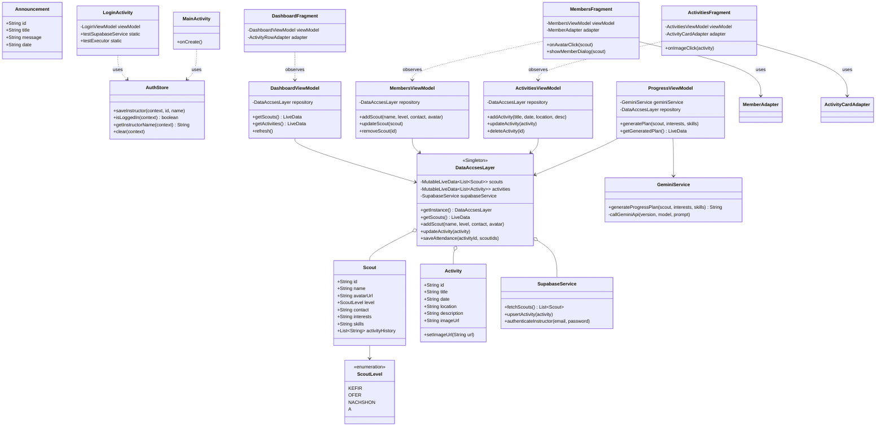

# ScoutsCentral UML Class Diagram

This diagram represents the architectural structure of the ScoutsCentral Android application, highlighting the MVVM pattern, the data layer, and the integration with external services (Supabase and Gemini AI).

### Architectural Notes:
- **MVVM Pattern**: Enforces strict separation between UI (Fragments), Logic (ViewModels), and Data (Models).
- **Repository Pattern**: `DataAccsesLayer` centralizes data access, providing a clean API for ViewModels while hiding the complexity of Supabase integration.
- **Dependency Injection**: Static test hooks in `LoginActivity` enable high-quality integration testing via Robolectric.
- **Observer Pattern**: `LiveData` is used throughout to ensure the UI remains reactive to asynchronous data changes.
- **AI Integration**: `GeminiService` implements a robust multi-model fallback logic to provide high availability for AI-generated content.
